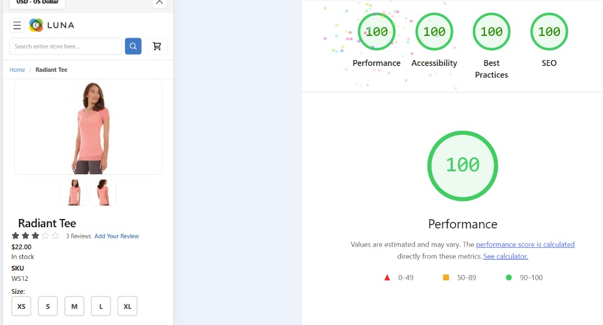
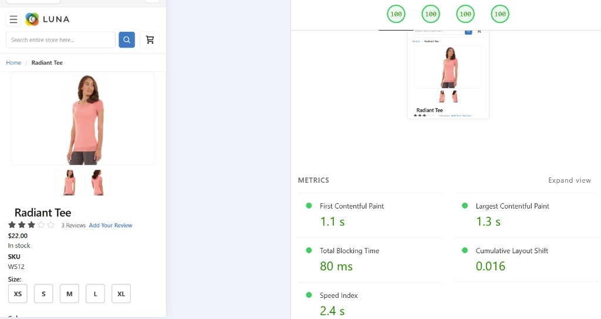
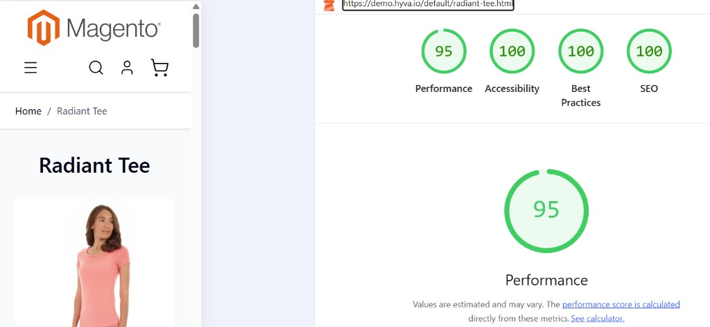
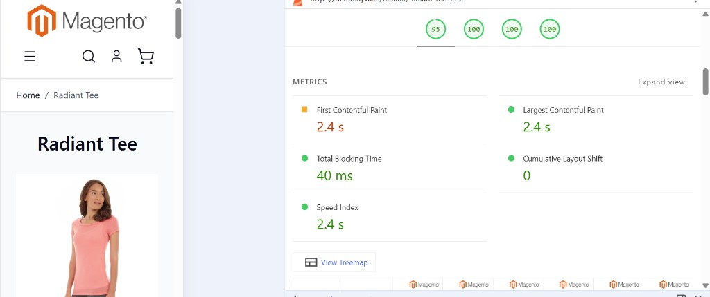

# Tailwind Luna


Composer-installable **Magento 2** theme: **`Genaker/tailwind_luna`** (`genaker/theme-frontend-tailwind-luna`), child of **`Magento/luma`**. **Source / issues:** [github.com/Genaker/Tailwind-Luna](https://github.com/Genaker/Tailwind-Luna).

### Story

**Tailwind Luna** is from the creators of [**React Luma**](https://github.com/Genaker/Luma-React-PWA-Magento-Theme) — a storefront theme built around speed. This project is the **Tailwind** take on **Magento Luma**: same **Open Source** foundation and **child-of-Luma** inheritance, **no Hyvä**, **no Alpine.js**, and **no magento compliance issue OSL 3.0 license with preservied magento copiryght** on top of Magento — just **Tailwind CSS** (plus small legacy  CSS like `checkout.css` adn some native styles) on top of Magento’s own templates and **Knockout / RequireJS** where the core still relies on them. You can also disable Adobe JS by using React Luma module and use it with any JS.

The goal is **Luma-level comaptability** with a **much leaner CSS payload** and a fast path to a modern utility-first stylesheet — performance you can measure on *your* stack (hosting, FPC, and deploy all matter).

Sample **mobile** Lighthouse screenshots (**Tailwind Luna** vs **Hyvä**) are in **[Lighthouse: sample PDP](#lighthouse-tailwind-luna-vs-hyva-sample)** below (scores vary by hosting, CDN, and cache).

<a id="tailwind-luna-vs-hyva"></a>

### Install Tailwind Luma Theme For Existing Magento Installation:

If you already have Magento 2.4.x running with demo data or not:

```bash
# 1. Install Tailwind Luna theme via Composer
composer require genaker/theme-frontend-tailwind-luna --ignore-platform-reqs

# 2. Enable the theme module
bin/magento module:enable Genaker_ThemeTailwindLuna

# 3. Run setup upgrade to register the theme
bin/magento setup:upgrade --no-interaction

# 4. Set as default theme (choose one method)

**First, find the Tailwind Luna theme ID:**
```bash
# List all available themes and their IDs
bin/magento theme:list
```

**Example output:**
```
Themes:
Magento/blank - ID: 2
Magento/luma - ID: 1
Genaker/tailwind_luna - ID: 4  ← Use this ID
```

**Now set Tailwind Luma as default:**
```bash
# Method A: CLI (recommended) - replace 4 with your theme ID if different
bin/magento config:set design/theme/theme_id 4

# Method B: Direct database - replace 4 with your theme ID
mysql -umagento -pmagento123 magento -e \
  "INSERT INTO core_config_data (scope, scope_id, path, value) VALUES ('default', 0, 'design/theme/theme_id', 4) ON DUPLICATE KEY UPDATE value=4;"

# 5. Deploy static content
bin/magento setup:static-content:deploy -f n_US

# 6. Clear caches
bin/magento cache:flush
```

### Tailwind Luna vs Hyvä


| Dimension | **Tailwind Luna** (Luma + Tailwind) | **Hyvä** |
|-----------|-----------------------------------------------------|------------------------------------------|
| **Relationship to Magento Luma** | **Child of `Magento/luma`**: incremental CSS modernization, reuse Luma layout and behavior where it still fits. | **Throws away** the classic Luma storefront theme stack — you **re-platform** the theme, not a light touch-up. |
| **Templates** | **Keep** core `.phtml` patterns; migrate classes and partials **gradually** (Tailwind utilities + optional SCSS merge). | **Big-bang rewrites**: new markup conventions; most of the storefront must be **re-authored** to Hyvä’s template style. |
| **JavaScript** | **Knockout / RequireJS** stay where Magento core still depends on them; you can pair with **React Luma** or other strategies separately. | **Alpine-first** stack **does not** map 1:1 to legacy Knockout flows — **more rework**, not a drop-in swap. |
| **Third-party themes & extensions** | **Luma-compatible** extensions and layouts often work with **targeted** template work — closer to “classic” Magento expectations. | **Extra spend and glue**: Hyvä-only modules, compatibility shims, and vendor-specific upgrades **pile on** cost and maintenance. |
| **Checkout** | **Standard Magento checkout** path (`checkout.css` + core flow) stays familiar; you optimize CSS around it. | **Stock checkout story is gone** unless you pay and integrate **Hyvä Checkout** — another product, another budget line, **drift from core Magento**. |
| **Licensing & compliance** | **OSL 3.0**-friendly path: **child of Luma**, preserve Magento copyright and extension compatibility expectations as usually understood for Luma children. | **Vendor lock-in**: proprietary theme + ecosystem; **ongoing fees** and **dependence** on Hyvä’s roadmap — **not** open-source Luma economics. |
| **Magento Open Source / OSL expectations** | Stays inside the **same** model as other **Luma child** themes: you ship theme code under the **Magento ecosystem rules** you already use for extensions and storefronts. | **We do not treat** Hyvä’s **commercial** theme stack as meeting the **same OSL / source-distribution expectations** as working **on top of** Magento Open Source the way a normal Luma-based theme does — **not legal advice**; verify with counsel. |
| **Proprietary vs “the Magento fork”** | **No** alternate “Magento”; you use **real** Magento Open Source + Luma + this theme’s CSS pipeline. | **Closed commercial product**: Hyvä is sold as **proprietary** software — **not** a gratis, fully open fork of Magento. Historically, **closed** commercial storefront packages have been **sold** in this ecosystem **without** the **same obligations** as the **Magento Open Source** distribution itself; **we are not lawyers** — confirm facts for your org. |
| **Learning curve for Magento teams** | **HTML/CSS + Tailwind** on top of **known** Luma structure — less “new platform” training. | **Steep retraining**: Tailwind + Alpine + Hyvä rules — **wasted** if your team already knows Luma/Knockout. |
| **Migration risk** | **Low blast radius**: ship utility CSS, tighten templates over time; roll back by CSS. | **High blast radius**: full theme swap, template mass-rewrite, extension matrix — **hard to roll back**; slipped timelines **hurt** badly. |
| **Build pipeline** | **Node** builds **Tailwind** in this theme package; **no** replacement of Magento’s PHP theme layer. | **Heavy opinionation**: you **must** adopt Hyvä’s spagetti code mindset — **not** “just swap CSS.” |
| **Vendor / stack lock-in** | **Magento + Luma + Tailwind** — boring, **portable** skills; swap Tailwind build or child theme without buying a storefront platform. | **Trapped in the stack**: hard to **exit** Hyvä without **another** expensive migration; frontend decisions **orbit** the vendor. |
| **Fit for Luma shops** | **Incremental wins**: lean CSS, same extension model, **no** mandate to replace the whole theme vendor. | **All-in bet**: pay for theme, checkout story, modules — **ill-suited** if you only wanted **better CSS** on Luma. |

<a id="lighthouse-tailwind-luna-vs-hyva-sample"></a>

#### Lighthouse: sample PDP (Tailwind Luna vs Hyvä)

Mobile emulation, **Radiant Tee** product page — same product for a like-for-like check. **Tailwind Luna** screenshots are from **our** storefront stack; **Hyvä** screenshots are from the public demo **[demo.hyva.io](https://demo.hyva.io/default/radiant-tee.html)**. 

**Tailwind Luna** (this theme):





**Hyvä** (official demo, same PDP URL path):





**How to read these runs**

- **Tailwind Luna (sample):** **Performance 100** with strong paint timing in this capture (e.g. sub‑~1.5s LCP band in the metrics panel — exact numbers are on the screenshot). That lines up with the theme’s goal: **lean CSS on Luma** without a full storefront rewrite.
- **Hyvä demo (sample):** **Performance 95**; **Accessibility / Best Practices / SEO** at **100** in this run. The detailed metrics show **FCP and LCP around ~2.4s** on mobile here, with Lighthouse flagging **FCP** as the main drag toward a perfect Performance score — **TBT** stays low and **CLS** is excellent (**0** in this capture), so the gap is mostly **early paint / perceived speed**, not JS blocking time.
- **Takeaway:** Both stacks can score **well**. In these samples, **Tailwind Luna** is **about twice as fast** on **FCP/LCP** as the **Hyvä demo** (exact figures are on the screenshots). **Tailwind Luna** still has **headroom**: you stay on **Luma + extensions** and add customization **incrementally** — every module shifts Lighthouse, but you avoid a **full theme replatform** just to ship styling. **Hyvä** are **already tuned to the edge**; in real projects, **extra customization, Alpine-heavy templates, and Hyvä-specific modules** often **pile on** until performance **drops hard** — the demo is **not** where most merchants end up. 

#### Note on Magento license, OSL, and Hyvä

**Tailwind Luna** is built as a **child of Magento Luma** and is intended to align with the **same kind of OSL 3.0 / Magento ecosystem** expectations as other community themes that **extend** Magento Open Source **without** replacing it.

**Hyvä** is a historically **commercial, proprietary** storefront stack. **We maintain** (our opinion only) that it **does not** occupy the **same license-compliance posture** as shipping a **Luma-derived** theme under Magento’s established open-source model — and that **historically**, **closed** commercial offerings tied to this space have been **sold** that are **not** equivalent to **distributing** or **forking** **Magento Open Source** under its **OSL** terms. **Adobe**, **Hyvä**, and **your counsel** should be consulted before you rely on any third-party stack for **trademark**, **copyright**, or **license** decisions.

#### Magento JS vs CSS 

A common **oversimplified** story is that “Magento’s JavaScript is the main performance villain.” In practice, **CSS weight, blocking assets, and layout work** usually dominate what shoppers feel on classic Luma — **not** a universal law that **RequireJS / Knockout** are inherently slower than every alternative. Hyvä’s stack leans on **Alpine.js** with a lot of **behavior inlined next to markup**; that is a **different** tradeoff (and one we find **harder to reuse, test, and evolve**) than Magento’s **module-bound JS** patterns — not an automatic upgrade for every team.

**Tailwind Luna** attacks the problem where this theme believes it matters most: **modern CSS** (Tailwind + merged SCSS) while **staying compatible with Magento’s extension and layout model**. You can still add **JS-side** improvements separately — for example **[React-Luma (`reactmagento2`)](https://github.com/Genaker/reactmagento2)**, a Composer module that optimizes the existing storefront **without** forcing a Hyvä-style theme migration: optional React/Vue, deferral, CSS tooling, and a path to **reduce reliance on default Magento JS** if that is your goal — **without** throwing away Luma compatibility for CSS.

For **microfrontend-style** boundaries (incremental React/Vue islands, when legacy Knockout can stay, and fast optional backends **gogento** / **nodegento** / **pygento** beside Magento APIs), see **[docs/MICROFRONTEND_REACT_LUMA.md](docs/MICROFRONTEND_REACT_LUMA.md)**.

For **CDN edge full-page cache** on Cloudflare (Worker + KV, high hit rates without replacing Luma), see **[docs/CLOUDFLARE_FPC_WORKER.md](docs/CLOUDFLARE_FPC_WORKER.md)** and the upstream repo **[CloudFlare_FPC_Worker](https://github.com/Genaker/CloudFlare_FPC_Worker)** — a complementary **frontend performance** path that does **not** require a Hyvä-style theme migration.

Today, much front-end code is **assisted or generated** (IDEs, LLMs). Whether a snippet is **RequireJS** or **Alpine** matters less for “who types it by hand” than for **architecture**: **separation of concerns**, reuse across templates, and how easily **extensions** can hook in — areas where **Tailwind Luna + classic Magento** stay closer to **stock Magento** than an **Alpine-everywhere-in-phtml** style.

**Summary:** **Tailwind Luna + Luma** — stay on Magento’s theme model, utility-first CSS, gradual changes, low risk, OSL-friendly, standard checkout, portable skills. **Hyvä** (why we steer away): full theme replacement, vendor lock-in, paid/proprietary ecosystem, big-bang migration, Alpine/template churn, hard exit cost; **we do not** equate its commercial model with **Magento OSL / Luma-child** compliance — see **Note on Magento license** above. Hyvä has happy users too — this section is **not** neutral; read **their** materials if you want the selling points.

---

### Documentation

| Doc | Topic |
|-----|--------|
| **[docs/CSS_BUILD_ARCHITECTURE.md](docs/CSS_BUILD_ARCHITECTURE.md)** | End-to-end CSS pipeline: merge → Sass → **`_merged.css`** → Tailwind → PostCSS (Autoprefixer + **Browserslist**, optional **cssnano**) → `pub/static`, scripts, prod vs dev builds. |
| **[docs/CSS_MERGE.md](docs/CSS_MERGE.md)** | SCSS merge: globs, layered **`scss.config.json`**, **`styles.yaml`** module-root config, tiers, **`--minify` / `--list` / `--verbose` / `--source-map`**, `input.css` import order, content vs merge. |
| **[docs/WARDEN.md](docs/WARDEN.md)** | **Warden (Docker):** `.env` / `.warden` at Magento root, tracked templates in **`warden/`**, `warden shell`, storefront URL, Tailwind + E2E; optional **[WardenGUI](https://github.com/Genaker/WardenGUI)** (`pip install wardengui`). |
| **[docs/TAILWIND_EXTENSION_DEVELOPMENT.md](docs/TAILWIND_EXTENSION_DEVELOPMENT.md)** | **Extensions:** new vs legacy modules, migration phases, utilities + module SCSS, raw CSS via layout, inline escape hatches. |
| **[docs/TAILWIND_CSS_SAFELIST.md](docs/TAILWIND_CSS_SAFELIST.md)** | Safelist for classes the JIT scanner cannot see. |
| **[docs/TEMPLATE_REWRITE_STATUS.md](docs/TEMPLATE_REWRITE_STATUS.md)** | Template rewrite tracking (maintainer tooling). |
| **[docs/MICROFRONTEND_REACT_LUMA.md](docs/MICROFRONTEND_REACT_LUMA.md)** | Microfrontend-style storefront with **[React Luma](https://github.com/Genaker/reactmagento2)**; incremental JS strategy; **gogento** (Go), **nodegento** (Node), **pygento** (Python) patterns for fast backends next to Magento. |
| **[docs/CLOUDFLARE_FPC_WORKER.md](docs/CLOUDFLARE_FPC_WORKER.md)** | **[Cloudflare Worker FPC](https://github.com/Genaker/CloudFlare_FPC_Worker)** — edge CDN full-page cache for Magento; pairs with Tailwind Luna + origin FPC; avoids Hyvä-only migration for global TTFB gains. |


**E2E (Playwright):** `npm run test:e2e` — shopping + account specs. **`npm run test:e2e:with-user`** runs **`e2e/scripts/ensure-e2e-user.php`**: uses **`E2E_USER_*`** if set, else **`roni_cost@example.com`** when sample data is installed, else creates **`e2e_playwright@example.test`**. **`npm run e2e:create-user`** prints the resolved JSON. Details: **`e2e/README.md`**. Set `PLAYWRIGHT_BASE_URL` if not using `https://app.luma.test`; use `SKIP_E2E_MAGENTO_USER=1` when PHP/Magento is unavailable.

### Warden (Docker)

If you use **[Warden](https://warden.dev/)**, configuration is at the **Magento project root** (`.env`, `.warden/`). **Tracked templates** live in this package under **`warden/`** — copy them to the project root so they stay in sync with git. Full steps: **[docs/WARDEN.md](docs/WARDEN.md)** (storefront URL, `warden shell`, Tailwind, Playwright). Optional **[WardenGUI](https://github.com/Genaker/WardenGUI)** CLI/TUI (`pip install wardengui`): install and usage are documented there.

### Refresh CSS

From the theme directory (paths relative to your Magento project):

```bash
cd packages/theme-frontend-win-luna   # adjust if needed
npm install
npm run build:tailwind     # emit utilities → web/css/tailwind.css
```

Then in Magento: `bin/magento setup:static-content:deploy` (and flush cache) as you normally would — often from **`warden shell`** if you develop in Docker.

**What `maintainer:sync` does:** reads `vendor/magento/module-*/view/frontend/templates`, writes mirrors here, maps **static** `class=""` tokens to Tailwind where rules exist, **leaves** attributes that contain `<?php` unchanged. For each attribute, **Tailwind utilities are prepended and any unmapped tokens are kept after them** (so JS/BEM hooks are not dropped when only some tokens map). If nothing would change, the attribute is left as in core. Luma’s two layered-navigation overrides are applied on top from `vendor/magento/theme-frontend-luma`.

Source: `scripts/maintainer-sync-templates.cjs` — treat as a **maintainer** tool; adjust heuristics there when a template still needs finer Tailwind.

### Styles overview

**Blank/Luma theme CSS is removed** via `Magento_Theme/layout/default_head_blocks.xml` (`styles-m.css`, `styles-l.css`, `print.css`). The storefront uses two delivery paths:

| Asset | Role |
|--------|------|
| **`web/css/tailwind.css`** / **`tailwind.min.css`** | **Generated** by Node: Tailwind CLI (no **`--minify`**) → expanded CSS; **`emit-tailwind-min-alias.cjs`** runs **cssnano** once and writes **both** files (same bytes). **Genaker\ThemeTileWindLuna\Block\ResolveCss** prefers **`tailwind.min.css`** when readable, else **`tailwind.css`**. |
| **`web/css/checkout.css`** / **`checkout.min.css`** | **Hand-written** checkout rules; **`minify-checkout.cjs`** emits **`checkout.min.css`**. **ResolveCss** prefers **`.min.css`** when readable, else the source file. |

---

### Build (Tailwind → `tailwind.css`)

**Architecture and merge** (globs, `scss.config.json`, `input.css` import order, PostCSS pipeline) are documented in **[docs/CSS_BUILD_ARCHITECTURE.md](docs/CSS_BUILD_ARCHITECTURE.md)** and **[docs/CSS_MERGE.md](docs/CSS_MERGE.md)**.

**Inputs (what you edit):**

| File | Purpose |
|------|--------|
| **`web/tailwind/input.css`** | Entry: **`@import "./_merged.css"` must be first**, then `@tailwind` layers (see merge doc). |
| **`web/tailwind/modules/*.scss`**, **`web/tailwind/extensions/*.scss`** | Theme partials; concatenated then compiled to **`_merged.css`** (see merge doc). Optional **`web/tailwind/scss.config.json`** plus per-module **`…/view/frontend/web/tailwind/scss.config.json`** for **`mergeRoots`**, **`exclude`**, **`tier`**, Tailwind **`contentFiles`**, pub paths. |
| **Magento modules** — **`view/frontend/web/tailwind/**/*.scss`** | SCSS next to the module; auto-merged from **`vendor/magento/module-*`**, **`app/code/*/*`**, **`src/**`** per **`scssRootGlobs`** in **`web/tailwind/sources.cjs`**. |
| **`styles.yaml`** (or **`styles.yml`**) at any **module root** |  Drop this file at `app/code/Vendor/Module/styles.yaml` to add SCSS from **any path** inside the module (not just `web/tailwind/`). Supports `inputs` (list of SCSS paths relative to the yaml), `tier` (0–2), and `exclude`. No theme edits required. See **[docs/CSS_MERGE.md](docs/CSS_MERGE.md)**. |
| **`web/tailwind/sources.cjs`** | **`scssRootGlobs`** (merge) + **`stylesYamlGlobs`** (styles.yaml discovery) + **`contentFiles`** (Tailwind JIT scan). |
| **`tailwind.config.js`** | Theme tokens; **`content.files`** from **`sources.cjs`** + **`_content-roots.json`**. |
| **`web/tailwind/css-safelist.html`** | Optional safelist — **[docs/TAILWIND_CSS_SAFELIST.md](docs/TAILWIND_CSS_SAFELIST.md)**. |

**Generated (do not edit by hand):** **`web/tailwind/_merged.scss`**, **`web/tailwind/_merged.css`**, **`web/tailwind/_content-roots.json`**, **`web/css/tailwind.css`**, **`web/css/tailwind.min.css`**, **`web/css/checkout.min.css`**. **`copy-tailwind-to-pub.cjs`** copies those CSS files into **`pub/static/.../css/`** (when present) and bumps **`pub/static/deployed_version.txt`**.

**Commands** (from this package directory, after `npm install`):

```bash
npm run build:tilewindscss        # merge → _merged.scss + _merged.css (expanded) + _content-roots.json
npm run build:tilewindscss:min    # same, but Sass **compressed** _merged.css (smaller intermediate file)
npm run build:tailwind            # merge + Tailwind → **cssnano** (emit) → checkout minify → **pub/static** + deployed_version.txt
npm run build:tailwind:opt        # merge **minified** + same pipeline as **build:tailwind**
npm run build:tailwind:prod       # **build-tailwind-prod.sh**: compressed merge + NODE_ENV=production (see CSS_BUILD_ARCHITECTURE.md)
npm run bump:static-version       # only update pub/static/deployed_version.txt (timestamp)
npm run build:css                 # **`scripts/build-css.sh`**: merge SCSS → sass → Tailwind → cssnano → **pub/static** + deployed_version (uses **npx** for sass/cssnano when missing from node_modules)
npm run watch:tailwind            # **chokidar**: re-merge + Tailwind when theme or module tailwind SCSS / scss.config.json changes
npm run test:scss                 # merge / config tests only (fast)
npm run test:build                # full Tailwind build + pub tests + **test:scss**
```

**Browser targets:** **`.browserslistrc`** (theme root) drives **Autoprefixer** (and any other Browserslist-aware tooling). It excludes legacy IE and Opera Mini; adjust if you must support older engines.

**Production optimizations:** **`npm run build:tailwind:prod`** runs **`scripts/build-tailwind-prod.sh`** (sets **`NODE_ENV=production`** and **`TAILWIND_CSS_PROD=1`**; compressed **`_merged.css`**). **cssnano** runs in **`emit-tailwind-min-alias.cjs`**, not in **`postcss.config.cjs`** for the default pipeline. **`cssnano`** and **`sass`** must be installed (`npm install` in this package). If **`npm install`** fails (e.g. permission errors under **`node_modules/`**), fix ownership and reinstall — otherwise the build will miss **cssnano** or **Sass** and stay unoptimized. **`build:tailwind:opt`** uses **minified** `_merged.css` with the same Tailwind + emit steps as **`build:tailwind`**. Default **`build:tailwind`** uses **expanded** `_merged.css` (easier diffs).

After changing **modules**, **SCSS** in Magento modules, **`tailwind.config.js`**, **`sources.cjs`**, templates, or layout XML classes, run **`build:tailwind`** (or **`build:tailwind:prod`** for release), then deploy static content / flush cache as needed.

**Tailwind v3 JIT** scans **`content`** globs and emits only utilities that appear in those files (plus `@apply` / custom CSS from merged SCSS). The Tailwind CLI uses **`--minify`** on the final bundle; Magento’s **Minify CSS** in admin is separate.

**Magento:** **`setup:static-content:deploy`** does not run Node; it materializes assets into **`pub/static`**. For dev, **`copy-tailwind-to-pub.cjs`** can refresh **`pub/static`** without a full deploy. In **developer** mode Magento may read theme files from source; you still need **`build:tailwind`** so **`tailwind.css`** exists.

**Typical loop**

```bash
cd packages/theme-frontend-win-luna
npm run build:tailwind
cd ../../..   # Magento root
bin/magento setup:static-content:deploy -f   # production / CI; adjust locales/themes
bin/magento cache:flush
```

**Layout:** utilities on **`Magento_Theme`** layouts (`htmlClass` on header, footer, messages). **`content`** includes **`Magento_*/**/*.xml`** so layout-only classes are picked up. For Magento **Developer** JS/CSS merge/minify/sign settings, see **JavaScript loading & static assets** below.

---

### Checkout CSS (separate file)

**Source:** **`web/css/checkout.css`** (edit this). **`scripts/minify-checkout.cjs`** writes **`checkout.min.css`** (cssnano).

**Global Tailwind** uses the same pattern: **`Block\ResolveCss`** with **`css_path`** = **`css/tailwind.css`** in **`Magento_Theme/layout/default.xml`** (`referenceBlock` **`head.additional`**); **`emit-tailwind-min-alias.cjs`** (single **cssnano** pass from expanded Tailwind output) writes **`tailwind.min.css`** and overwrites **`tailwind.css`** with the same minified bytes.

**Where checkout CSS is wired:**

| Layout handle | File |
|---------------|------|
| Shopping cart | `Magento_Checkout/layout/checkout_cart_index.xml` |
| One-page checkout | `Magento_Checkout/layout/checkout_index_index.xml` |

**ResolveCss** (companion module **`Genaker_ThemeTileWindLuna`**, PHP under **`Module/ThemeModule/`** in this theme package — Composer autoloads it with the theme) reads the **`css_path`** argument, resolves **`{path}.min.css`** first if the file exists on disk, otherwise **`{path}.css`**. **Magento’s** own **Minify CSS** (Stores → Advanced → Developer) can still minify deployed static files in production.

**Why separate:** keeps cart/checkout layout rules out of the global Tailwind bundle.

**Workflow:** run **`npm run build:tailwind`** (or **`build:checkout`** for checkout only) so **`*.min.css`** files exist; **`copy-tailwind-to-pub`** mirrors them to **`pub/static`**. Flush cache / deploy static as needed.

---

Some **module** stylesheets (e.g. calendar) may still load from layout handles; remove those in XML only if you want zero non-Tailwind CSS.

**Do not** inject **Sample Data / Luma** `media/styles.css` via **Stores → Configuration → Design → HTML Head → Miscellaneous Scripts/Styles** (`design/head/includes`). That file (e.g. `{{MEDIA_URL}}styles.css`) uses rem scaling and Luma icon fonts and will clash with this theme’s layout until its rules are recreated in `input.css`.

### Sample data widgets

Depends on **`genaker/module-tailwind-luna-widgets`** (widgets cloned for **Genaker/tailwind_luna**). Run **`bin/magento setup:upgrade`** after install.

### Install (path repo)

```json
{
  "repositories": [
    {
      "type": "path",
      "url": "packages/theme-frontend-win-luna",
      "options": { "symlink": true }
    }
  ],
  "require": {
    "genaker/theme-frontend-tailwind-luna": "^1.0"
  }
}
```

```bash
composer update genaker/theme-frontend-tailwind-luna
bin/magento setup:upgrade
bin/magento cache:flush
```

### Activate

**Admin → Content → Design → Configuration** → **Tailwind Luna** (`Genaker/tailwind_luna`).

Parent chain: **Genaker/tailwind_luna** → **luma** → **blank**.

---

### JavaScript loading & static assets (required for this theme)

For predictable RequireJS order, easier debugging, and sane front-end behavior, **keep** these **Advanced → Developer** settings (or the same values in `app/etc/env.php` under `system` → `default` → `dev`):

| Goal | Magento setting | Config path | Use |
|------|-----------------|-------------|-----|
| Load scripts late (no global `defer` toggle in core) | **Move JS code to the bottom of the page** = **Yes** | `dev/js/move_script_to_bottom` | **Yes** — moves inline/linked scripts before `</body>` (`JsFooterPlugin`). |
| No merged mega-files | **Merge JavaScript Files** = **No** | `dev/js/merge_files` | **No** |
| No RequireJS bundles | **Enable JavaScript Bundling** = **No** | `dev/js/enable_js_bundling` | **No** — enabling bundling was tested and caused **Total Blocking Time to spike to ~940 ms** (Lighthouse red) on a PDP; the built-in bundler creates large synchronous RequireJS bundles that block the main thread. Keep off. |
| Minify core JS (not Tailwind) | **Minify JavaScript Files** = **Yes** (prod) | `dev/js/minify_files` | **Yes** in production; skipped in **developer** mode |
| No merged CSS | **Merge CSS Files** = **No** | `dev/css/merge_css_files` | **No** |
| Minify core CSS (not Tailwind) | **Minify CSS Files** = **Yes** (prod) | `dev/css/minify_files` | **Yes** in production; skipped in **developer** mode |
| Cache-busted static URLs | **Sign Static Files** = **Yes** | `dev/static/sign` | **Yes** (recommended with `setup:static-content:deploy`) |

You can use this one command for applying all recommended settings:

```
bin/magento config:set dev/js/move_script_to_bottom 1 &&\
bin/magento config:set dev/js/merge_files 0 &&\
bin/magento config:set dev/js/enable_js_bundling 0 &&\
bin/magento config:set dev/js/minify_files 1 &&\
bin/magento config:set dev/css/merge_css_files 0 &&\
bin/magento config:set dev/css/minify_files 1 &&\
bin/magento config:set dev/static/sign 1
```

Magento does **not** offer a single “add `defer` to every script” switch; **move JS to bottom** is the supported way to avoid parser-blocking scripts in `<head>` for typical storefront output.

After changing config: `bin/magento cache:flush` (and `app:config:import` if you rely on `config.php` pipeline config).

### License

Licensed under the **Open Software License 3.0 (OSL-3.0)** and **Academic Free License 3.0 (AFL-3.0)** — the same dual-license model as Magento Open Source core. See **`COPYING.txt`** for the short notice, **`LICENSE.txt`** (OSL), and **`LICENSE_AFL.txt`** (AFL). `composer.json` declares `"license": ["OSL-3.0", "AFL-3.0"]`.
