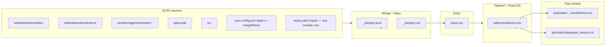

# CSS build architecture

This theme replaces most Luma/Blank CSS with a **single generated** `tailwind.css`, built with **Node** (Tailwind v3, PostCSS, Sass) **outside** Magento’s LESS pipeline.

## High-level flow



## Components

| Piece | Role |
|--------|------|
| **`web/tailwind/sources.cjs`** | Single place for **SCSS merge globs** (`scssRootGlobs`) and **Tailwind content globs** (`contentFiles`). `tailwind.config.js` imports `contentFiles` and merges optional `_content-roots.json`. |
| **`scripts/merge-scss.cjs`** | Collects all matching `*.scss`, sorts by **tier** + path (see [CSS_MERGE.md](./CSS_MERGE.md)), concatenates into **`web/tailwind/_merged.scss`**, compiles with **Sass** into **`web/tailwind/_merged.css`**, writes **`web/tailwind/_content-roots.json`**. Flags: **`--minify`**, **`--list`**, **`--verbose`**, **`--source-map`**. |
| **`web/tailwind/scss-config.cjs`** | Loads layered **`scss.config.json`** (theme + each module `…/web/tailwind/`), merges **`mergeRoots`**, **`exclude`**, **`contentFiles`**, **`tier`**, **`pubStaticPath(s)`**. Also discovers and loads all **`styles.yaml`** files (see below). Unknown keys warn. |
| **`web/tailwind/input.css`** | Tailwind entry: **`@import "./_merged.css"` must come first** (before `@tailwind`), then `@tailwind base/components/utilities`. See [CSS_MERGE.md](./CSS_MERGE.md). |
| **`postcss.config.cjs`** | **`postcss-import`** (with **`postcss-scss`**) inlines **`_merged.css`**; **tailwindcss** + **autoprefixer** process the result. **cssnano** does **not** run here — **`scripts/emit-tailwind-min-alias.cjs`** minifies once (avoids stacking Tailwind `--minify` + PostCSS cssnano for negligible gain). |
| **`.browserslistrc`** | Theme-root **Browserslist** queries for **Autoprefixer** (and other tooling). Excludes legacy IE / Opera Mini by default; edit to widen or narrow support. |
| **`tailwind.config.js`** | Theme tokens, `content` globs for JIT scanning (templates, layout XML, SCSS, etc.). |
| **`npm run build:tailwind`** | `merge-scss` (expanded **`_merged.css`**) → Tailwind CLI (no **`--minify`**) → **`emit-tailwind-min-alias.cjs`** (cssnano → **`tailwind.css`** + **`tailwind.min.css`**) → **`minify-checkout`** → **`copy-tailwind-to-pub.cjs`** → **`bump-static-deploy-version.cjs`**. |
| **`npm run build:tailwind:opt`** | Merge with **`--minify`** + same Tailwind + emit + checkout + pub copy. |
| **`npm run build:tailwind:prod`** | Runs **`scripts/build-tailwind-prod.sh`**: compressed **`_merged.css`**, **`NODE_ENV=production`** + **`TAILWIND_CSS_PROD=1`** (reserved for tooling); **cssnano** runs only in **`emit-tailwind-min-alias.cjs`**. Requires **`sass`** and **`cssnano`** (`npm install`). |
| **`scripts/copy-tailwind-to-pub.cjs`** | Copies `web/css/tailwind.css` into each configured **`pub/static/frontend/.../css/`** path (both registered theme codes). Replaces symlinks safely. |
| **`scripts/bump-static-deploy-version.cjs`** | Writes **`pub/static/deployed_version.txt`** (Unix ms timestamp) for cache busting. |
| **`scripts/watch-tailwind.cjs`** | **Chokidar** watches theme `web/tailwind` and Magento **`vendor` / `app/code` / `src`** `**/view/frontend/web/tailwind/**/*.{scss,json}`; debounced **re-merge + Tailwind** (Tailwind’s own **`--watch`** does not re-run merge for vendor/module SCSS). |
| **`npm run test:scss`** | Runs **`merge-scss-modules.test.cjs`** + **`merge-scss-config.test.cjs`** only (no full **`build:tailwind`**). |

## Browser targets (Autoprefixer)

**`.browserslistrc`** in the theme package root is picked up when you run **`npm`** commands from that directory. Default queries: **`>= 0.5%`**, **`last 2 versions`**, **`not dead`**, exclude **IE ≤ 11**, **IE Mobile ≤ 11**, **Opera Mini**.

To verify resolved browsers:

```bash
cd packages/theme-frontend-win-luna
npx browserslist
```

## Production vs development builds

| Script | `_merged.css` | Tailwind CLI | Final **`tailwind.css`** |
|--------|----------------|--------------|---------------------------|
| **`build:tailwind`** | Sass **expanded** | no **`--minify`** (expanded CSS for one cssnano pass) | **cssnano** in **`emit-tailwind-min-alias.cjs`** (same bytes written to **`tailwind.min.css`**) |
| **`build:tailwind:opt`** | Sass **compressed** | no **`--minify`** | same |
| **`build:tailwind:prod`** | Sass **compressed** | no **`--minify`** | same |

Use **`build:tailwind`** for day-to-day work. **`cssnano`** is required in **`package.json`** devDependencies for **`emit-tailwind-min-alias.cjs`**.

**Smaller bundles** come mostly from **narrowing** `contentFiles` in **`sources.cjs`** (fewer JIT utilities), not from stacking minifiers. **`@apply`** in SCSS still emits CSS into the bundle; moving utilities onto real markup can help the scanner drop unused rules.

## Where CSS is authored

1. **Theme package** — `web/tailwind/modules/*.scss`, `web/tailwind/extensions/*.scss` (and optional roots in `scss.config.json`).
2. **Magento modules (web/tailwind path)** — `view/frontend/web/tailwind/**/*.scss` inside any module under `vendor/magento/module-*`, `app/code/*/*`, or `src/**` (auto-discovered by `scssRootGlobs` in `sources.cjs`).
3. **Magento modules (any path via `styles.yaml`)** — drop a `styles.yaml` at **any module root** and list SCSS files under `inputs`; paths are relative to the yaml file so CSS can live anywhere in the module (e.g. `view/frontend/web/css/`). Discovered automatically via `stylesYamlGlobs`. Supports `tier` (0–2) and `exclude`.
4. **Utilities** — Tailwind classes in `.phtml`, layout XML `htmlClass`, etc.; scanned per `contentFiles`.

### Choosing the right extension point

| SCSS location | Discovery method |
|---------------|-----------------|
| `…/view/frontend/web/tailwind/**/*.scss` | Automatic — `scssRootGlobs` |
| Anywhere else in the module | **`styles.yaml`** at the module root (list under `inputs`) |
| Need extra `contentFiles` or `pubStaticPath` | `scss.config.json` inside `…/view/frontend/web/tailwind/` |

## What Magento still does

- **`setup:static-content:deploy`** materializes theme and module assets into `pub/static` (this theme also supports **direct copy** of `tailwind.css` for faster dev).
- This theme **does not** use Magento’s LESS compilation for the main storefront bundle; **`tailwind.css`** is produced by **npm**, not `bin/magento`.

## Related

- [CSS_MERGE.md](./CSS_MERGE.md) — merge order, tiers, globs, Sass flags, layered **`scss.config.json`**, **`styles.yaml`** module root config, **`--list` / `--verbose` / `--source-map`**.
- [TAILWIND_EXTENSION_DEVELOPMENT.md](./TAILWIND_EXTENSION_DEVELOPMENT.md) — extensions: utilities, module SCSS, migration, raw CSS / layout / inline.
- [TAILWIND_CSS_SAFELIST.md](./TAILWIND_CSS_SAFELIST.md) — classes not visible to the scanner.
