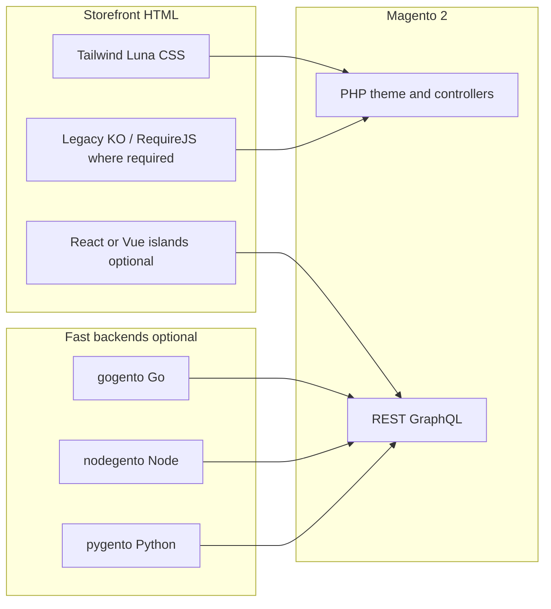

# Microfrontend architecture and React Luma

This document explains how **Tailwind Luna** fits into a **microfrontend-style** storefront plan: keep Magento’s PHP theme and templates, modernize CSS here, and optionally **layer or replace** default Magento JavaScript using the **[React Luma](https://github.com/Genaker/reactmagento2)** module (`genaker/react-luma` on Composer). It also sketches how **fast polyglot backends** — **gogento** (Go), **nodegento** (Node.js), **pygento** (Python) — can sit **beside** Magento without forcing a full headless rewrite.

---

## What “microfrontend” means here

In this context we mean **incremental UI ownership**, not necessarily a single-page app:

- **Magento** remains the **system of record** (catalog, cart, checkout, customer, admin).
- The **theme** (Tailwind Luna) stays a **child of Luma**: `.phtml`, layout XML, and extension compatibility stay familiar.
- **Behavior** can be split into **islands**: some regions still use **RequireJS / Knockout** where core requires it; other regions can use **vanilla JS**, **React**, **Vue**, or **Preact** loaded only where needed.
- **Boundaries** are practical: separate bundles, separate initialization, and clear contracts (DOM containers, `data-*` hooks, customer sections, or REST/GraphQL) instead of one monolithic global script.

That is closer to **“progressive enhancement + optional modern bundles”** than to a mandatory full front-end rewrite.

---

## React Luma module ([reactmagento2](https://github.com/Genaker/reactmagento2))

**React Luma** is a **Composer module** that optimizes the existing Luma-oriented storefront **without** migrating to Hyvä or replacing the theme wholesale. Highlights from the upstream project:

- **Defer and ordering:** optional **defer / move scripts to bottom**, respect for `no-defer`, and alignment with **RequireJS** mixins rather than replacing core files blindly.
- **Bundling:** upstream documentation recommends **disabling Magento’s JS bundling** (large synchronous bundles hurt Core Web Vitals) and using **minification** instead.
- **CSS:** optional optimized CSS delivery and tooling (purge, compile) — complementary to **this theme’s** Tailwind pipeline; coordinate so you do not load duplicate or conflicting global CSS.
- **Frameworks:** path to add **React**, **Vue**, or other libraries **incrementally** for specific features while other areas keep legacy Magento JS.

Install and configuration are documented in the **[reactmagento2 README](https://github.com/Genaker/reactmagento2)** (for example `composer require genaker/react-luma`, static deploy notes, and admin/CLI flags such as `react_vue_config/junk/defer_js`).

**Tailwind Luna** and **React Luma** are designed to work together: this theme addresses **CSS weight and utility-first styling**; React Luma addresses **JS delivery and optional modern bundles**. You choose how far to go on each axis.

---

## When you can switch away from “default Magento JS”

You rarely flip one switch and delete all legacy JS. A realistic sequence:

1. **Stabilize delivery:** defer non-critical scripts, avoid bundling megabytes into one blocking file, minify in production — see **[MAGENTO_JS_PERFORMANCE.md](MAGENTO_JS_PERFORMANCE.md)** and React Luma’s JS settings.
2. **Identify boundaries:** checkout, customer account, swatches, and minicart often have deep Knockout ties; replacing them is a **feature-by-feature** decision.
3. **Introduce islands:** mount a React/Vue root on a `div` id from a template, pass configuration from PHP or `window` safely, and load a small bundle only on pages that need it.
4. **Keep contracts:** use Magento’s **sections** (`customer/section/load`), **REST/GraphQL**, and form keys where applicable so custom UI stays consistent with cart and session.

The React Luma module is aimed at teams that want **better performance and optional React/Vue** **without** throwing away Luma compatibility for CSS and extensions.

---

## Fast backends: gogento, nodegento, pygento

**gogento**, **nodegento**, and **pygento** are **names for a pattern**, not a single shipped product: small, **fast** services in **Go**, **Node.js**, and **Python** that live **next to** Magento and handle work PHP should not do on the hot path (heavy integration, ML, streaming, or high-throughput I/O).

| Stack | Why it is fast / a good fit | Typical roles beside Magento |
|--------|-----------------------------|-------------------------------|
| **gogento** (Go) | Small static binaries, cheap goroutines, strong stdlib for HTTP and concurrency, predictable latency | Edge gateways, API aggregators, **rate-limited** workers, **webhook receivers**, **queue consumers** at high throughput, health-checked sidecars |
| **nodegento** (Node.js) | One language with storefront tooling; **non-blocking I/O**; huge npm ecosystem | **BFF** (backend-for-frontend) for React/Vue islands, **real-time** (SSE/WebSocket) facades, **serverless** or **edge** functions, thin proxies to Magento REST/GraphQL |
| **pygento** (Python) | Rich **data science** and **ML** stack; **rapid scripting** for integrations | **Recommendations**, **search ranking** experiments, **ETL** (PIM/ERP → Magento), **batch jobs**, **Celery/RQ** workers, **reporting** pipelines |

**Magento remains authoritative** for **cart, checkout, catalog URLs, and customer auth** unless you deliberately build a headless checkout. Services above should **call Magento** (REST, GraphQL, async integrations) instead of re-implementing core commerce rules.

### Principles for fast, safe services

1. **Prefer APIs over direct DB access** from gogento/nodegento/pygento — keeps **one source of truth** in Magento and avoids schema drift.
2. **Authenticate** with integration tokens or OAuth as appropriate; **scope** integration users to least privilege.
3. **Cache** read-heavy responses (Redis, CDN) at the service layer; **invalidate** on events or short TTLs where data must be fresh.
4. **Queues** (RabbitMQ, Redis streams, cloud queues) for **async** work so Magento HTTP requests stay short.
5. **Horizontal scale** stateless workers behind a load balancer; **avoid** sticky sessions unless required.

### When each stack helps most

- **gogento** — You need **maximum throughput per CPU**, **low memory**, or **simple deploy** (single binary). Great for **fan-out** workers and **multi-tenant** proxies.
- **nodegento** — You want **one team** to own **frontend + BFF** with shared TypeScript types, or **streaming** responses to the browser.
- **pygento** — You need **models**, **notebooks**, **pandas**, or **vendor SDKs** that are Python-first; ship **batch** or **async** jobs that **push** results back via Magento APIs.

This theme does **not** ship gogento/nodegento/pygento code; it **documents** the split so **Tailwind Luna** + optional **React Luma** on the storefront and **fast backends** in the datacenter stay aligned.

---

## Related docs in this repo

| Doc | Role |
|-----|------|
| **[MAGENTO_JS_PERFORMANCE.md](MAGENTO_JS_PERFORMANCE.md)** | In-place JS performance fixes on Luma without Hyvä. |
| **[CSS_BUILD_ARCHITECTURE.md](CSS_BUILD_ARCHITECTURE.md)** | Tailwind and merged SCSS pipeline for this theme. |
| **[TAILWIND_EXTENSION_DEVELOPMENT.md](TAILWIND_EXTENSION_DEVELOPMENT.md)** | Extending CSS/JS from Magento modules. |
| **[CLOUDFLARE_FPC_WORKER.md](CLOUDFLARE_FPC_WORKER.md)** | **[Cloudflare Worker FPC](https://github.com/Genaker/CloudFlare_FPC_Worker)** — edge CDN cache layer; complements this theme without a Hyvä migration. |

---

## References

- **React Luma (reactmagento2):** [https://github.com/Genaker/reactmagento2](https://github.com/Genaker/reactmagento2)
- **Cloudflare Worker FPC:** [https://github.com/Genaker/CloudFlare_FPC_Worker](https://github.com/Genaker/CloudFlare_FPC_Worker) — see **[CLOUDFLARE_FPC_WORKER.md](CLOUDFLARE_FPC_WORKER.md)** in this repo.
- **This theme (source):** [https://github.com/Genaker/Tailwind-Luna](https://github.com/Genaker/Tailwind-Luna)
- **Luma React PWA theme (related project, separate repo):** linked from the same ecosystem; use the table in the main **README** for this theme’s scope.
